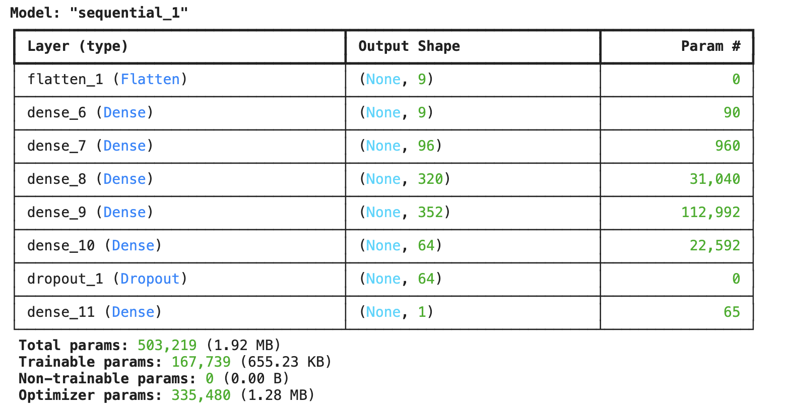

# CSE151A-GroupProject

# Introduction to our project

# Milestone 1 Tasks: Abstract

Our project leverages a dataset of Airbnb listings to build a predictive model for nightly prices. By employing supervised machine learning techniques, we aim to predict listing prices based on features such as property details, host information, and location. Additionally, we plan to create a recommendation model that, given an asset’s details and the listing price, suggests the income (calculated by considering metrics like reviews per month and price). The dataset includes various attributes like property features, amenities, rating, reviews per month. Our findings will assist in optimizing pricing strategies for both hosts and customers.

# Milestone 2 Tasks:

### 1. Download data:

We manually downloaded multiple `listing.csv` files from [insideairbnb.com](https://insideairbnb.com/get-the-data/)
. We then renamed the each file according to its city and stored the file in `data` folder. Then, we ran [download_combine_data.ipynb](https://github.com/chengyuanmao819/CSE151A-GroupProject/blob/milestone2_Evaluate_Data_and_Plot_data/download_combine_data.ipynb) to combine all the listings into `all_data.csv` file

### 2. How do we process our data?
  - View [Data Dictionary: ](https://docs.google.com/spreadsheets/d/1iWCNJcSutYqpULSQHlNyGInUvHg2BoUGoNRIGa6Szc4/edit?usp=sharing)   
  - Suggest: drop `id`, `name`, `host_id`, `host_name` (this one might play a role. Catchy names or words might increase click, but how to analyze this?), `neighbourhood_group`, `neighbourhood` (we already had `city` column, `neighbourhood` is too specific), `license`
  - keep: 
    - `latitude`, `longtitude` (these 2 might be well correlated). 
    - `room_type` might need to be encoded to integer, for example, `Entire home/apt`:3, `Private room`:2...
    - `minimum_nights`
    - `number_of_reviews`
    - `last_review`, `number_of_reviews_ltm`: this reflects how active the listing is, how often and recent it got rent. Convert the date so that the most recent has higher integer values?
    - `reviews_per_month`
    - `calculated_host_listings_count`
    - `availability_365`
    - `city`: encode to int for float
  - target: `price`

### 3. Do values need to be cropped? normalized?

Looking at part 1.2, "Details about the Data Distributions," we can see that the data is extremely skewed due to anomalies or outliers. For example, the feature price has a 75th percentile of $271 per night, but the maximum value is up to $100,000 per night, which is quite unrealistic. Similarly, reviews_per_month has a 75th percentile of 2.26, while its maximum value is 88.95. These extremes make the pairplot squeezed, and we can't visually interpret the data. Our solution is to remove these anomalies and outliers using the [Interquartile Range](https://medium.com/analytics-vidhya/removing-outliers-understanding-how-and-what-behind-the-magic-18a78ab480ff). 

The features that we look to remove extremes from are `['price', 'number_of_reviews_ltm', 'minimum_nights', 'calculated_host_listings_count']`

For our prediction, we will try building models that either train on non-normalized or normalized data. Since all our features seem normally distributed, we'll try z-score standardization of the data.

For unsupervised machine learning tasks, we'll use normalized data, so that the component vectors are not affected by the different scales of the features and can provide a more accurate representation of the underlying structure. Normalizing the data ensures that each feature contributes equally to the analysis, preventing features with larger scales from dominating the results.

### 4. Link to Jupyter Notebook: [milestone2.ipynb](https://github.com/chengyuanmao819/CSE151A-GroupProject/blob/milestone2/milestone2.ipynb)

# Milestone 3 Tasks:

## Principle Component Analysis [explore_preprocess.ipynb](https://github.com/chengyuanmao819/CSE151A-GroupProject/blob/Milestone3/explore_preprocess.ipynb)

We performed Principal Component Analysis (PCA) on `all_data.csv`, which includes samples from 34 cities/regions in the USA, and `sandiego_listings.csv`, which contains samples from San Diego County. We then projected the data onto 2D plots (PC1 and PC2) and 3D plots (PC1, PC2, and PC3).

 
<!-- _Put these two plots on the same row for easy comparison_ -->

 

For each feature, we plotted an arrow (based on the coefficient of each PC), where each arrow's direction and magnitude reflect how well the feature aligns with PC1, PC2, or PC3. This allows us to understand how well the features are correlated with each other.

The table represents the coefficients of the first principal component (PC1) in Principal Component Analysis (PCA). Each coefficient indicates the contribution of the corresponding feature to PC1. 

| Rank | Value | Feature                          |
|------|-------|----------------------------------|
| 0    | -0.34 | minimum_nights                   |
| 1    | -0.15 | availability_365                 |
| 2    | -0.08 | price                            |
| 3    | -0.08 | room_type                        |
| 4    | -0.08 | latitude                         |
| 5    | -0.07 | calculated_host_listings_count   |
| 6    | 0.00  | longitude                        |
| 7    | 0.48  | number_of_reviews                |
| 8    | 0.55  | reviews_per_month                |
| 9    | 0.55  | number_of_reviews_ltm            |

Features with large positive or negative coefficients are more strongly correlated with PC1.
If two features have coefficients with the same sign, they are positively correlated with each other in the context of PC1. For example, `number_of_reviews` (0.48), `reviews_per_month` (0.55), and `number_of_reviews_ltm` (0.55) all have large positive coefficients, indicating they are positively correlated with each other and with PC1.
Conversely, features with coefficients of opposite signs are negatively correlated. For instance, `minimum_nights` (-0.34) and `number_of_reviews_ltm` (0.55) have opposite signs, indicating a negative correlation between price and `number_of_reviews_ltm`.

From the plot and the table, we can observe that `price` aligns with PC2 and has a positive correlation with `calculated_host_listings_count`. On the other hand, `room_type` and `longitude` appear to be negatively correlated with `price`. The values of `room_type` were originally discrete (['Entire home/apt', 'Private room', 'Shared room', 'Hotel room'] = [0, 1, 2, 3]). After MinMax scaling, they became [0, 0.333, 0.666, 1]. It makes sense that the lower the `room_type` value, the higher the `price`. Additionally, it is logical that the lower the `longitude`, the closer the listing is to the coast, hence the higher the `price`.

The group of `reviews...` features are closely related to each other and are mainly perpendicular to PC1, indicating that they are not well correlated with features such as `price`.

By narrowing our sample size to San Diego, the features become more meaningful and seem to be more correlated.

## Model 1: Price Prediction Model

### Brief Summarize the Model
This model is designed to predict the prices of houses in California based on various features such as location, number of reviews, number of bedrooms, and other relevant attributes. The model utilizes a neural network with k-fold validation and hyperparameter tuning to achieve optimal performance. The dataset used for training and testing includes comprehensive data on housing prices and their respective features.

### Links to the works
[priceprediction_model.ipynb](priceprediction_model.ipynb)

### Does the model fit in the fitting graph? Is it underfitting (high bias), overfitting (high variance), or well-balanced?
Both the training and validation losses are low and similar, the model is well-balanced.

### Summarize the performance and some findings
- Mean Squared Error (MSE): 0.0247

#### Key Findings
- The model performs well on the test set, indicating that it has learned the underlying patterns in the data.
- Mean Squared Error (MSE): The MSE is relatively low, which indicates the model is making small errors in predicting the continuous values.
- The scatter plot of true versus predicted values shows a concentration of predicted values around a lower range, indicating the model's tendency to underestimate prices. The red diagonal line represents the ideal prediction where the true values match the predicted values.
  
- The residuals plot shows a pattern that suggests the model is not capturing the underlying data distribution effectively. The spread of residuals is uneven, indicating potential issues with model bias.
  
- Here's the new best price prediction model we got so far:
  
  The new model appears more complex with more parameters and layers, which might capture more intricate patterns in the data. The use of a dropout layer suggests an attempt to regularize the model and prevent overfitting. 

### Improvement
- Improve feature selection and engineering to include more relevant features that may impact price prediction.
- Continue fine-tuning hyperparameters using techniques like RandomizedSearchCV or Bayesian Optimization to find the optimal configuration for the model.
- Consider augmenting the dataset if possible to include more diverse examples, which may help the model generalize better.
- Adding batch normalization layers after the activation function
- Experiment with batch sizes in the range of 100-1000. The reason behind this adjustment is that using whole batch gradient descent might lead to misleadingly low MSE. When batch sizes are too large, the model may learn to predict lower values consistently, thus minimizing MSE but not improving the accuracy of predictions. Smaller batch sizes introduce more variability in the gradient updates, and it can lead to a better model.

## Model 2: Income Group Classification Model

### Brief Summarize the Model

Our goal is to create a model that, given features such as `latitude`, `longitude`, `room_type`, `price`, `minimum_nights`, `calculated_host_listings_count`, and `availability_365`, can predict which income group the listing might fall into.

At the moment, we created a new feature `income` with the formula: 
`data['income'] = data['price'] * data['minimum_nights'] * data['reviews_per_month']`.

Then, we found the values of the 25th percentile, 50th percentile, 75th percentile, and 100th percentile of the `income`, and assigned each sample into one of the four groups based on its value.

We could simply use a regression model for this prediction task. However, we want to practice using a classification model. Additionally, since our features are not very well correlated with each other, classification and finding the likelihood is a more feasible task.

### Links to the works 
[classification_model.ipynb](classification_model.ipynb)

### Does the model fit in the fitting graph? Is it underfitting (high bias), overfitting (high variance), or well-balanced?

The model is slightly overfitting, as we set the `EarlyStopping's patience=10`, with less patience, the model's train accuracy would be closer to test's accuracy. 

### Summarize the performance and some findings

The accuracy of the model is about 50%, which is not ideal in real life. Nevertheless, when examining the likelihood percentage of each class, we find that when the predicted income group with the highest likelihood is not the actual income group, it is almost certain that the predicted income group with the second highest likelihood will be the actual income group. This means our prediction is still within a quite good range of the confidence interval.

For more details, please see the `Result` section in [classification_model.ipynb](classification_model.ipynb). We predict 10 random samples and plot the prediction and likelihood.

### Improvement

**Improvement:**

If we had features such as the number of beds, baths, nearby attractions, etc., which can actually refer to the value of the listing and are well correlated with the income, our model could perform better. Customers don't always leave reviews, so the `number_of_reviews` feature doesn't reflect the income very well.

For now, we'll focus on finding more meaningful features that can be added to our dataset. We will need to clean up the data more thoroughly. For example, removing old listings (those with a `last_review` before 2020) can help reduce the noise in our data.

## Next Model?

# Milestone 4

## Model_1_Hyperparameter_Tuning

## Model_2_Classification

## Model_3_SVM

## Model_4_Word_Embeding

# Statement of Collaboration
