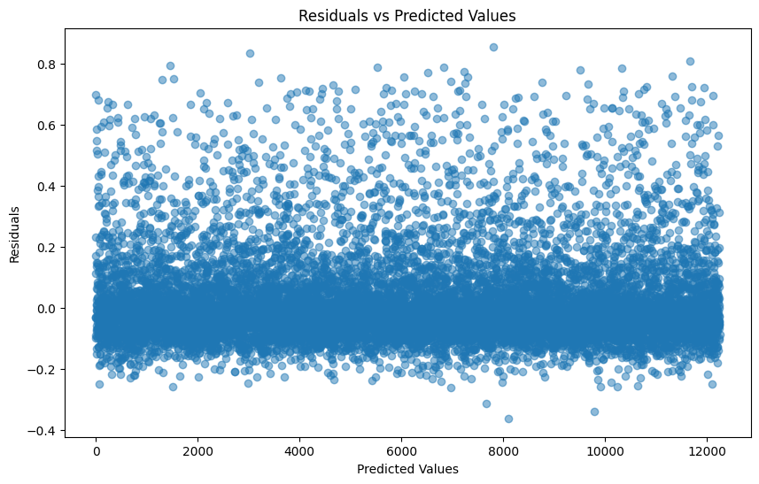
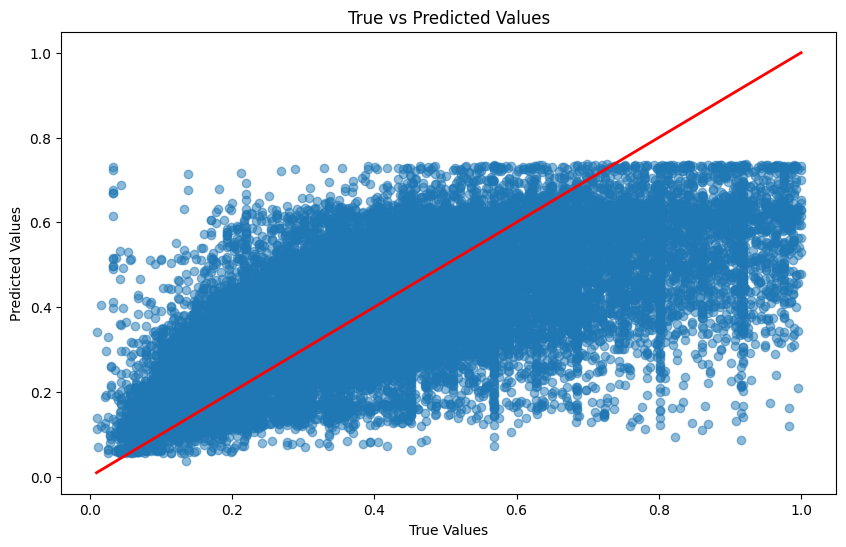

# CSE151A-GroupProject

## Table of Contents

1. [Introduction to our project](#introduction-to-our-project)
2. [Milestone 1 Tasks: Abstract](#milestone-1-tasks-abstract-top)
3. [Milestone 2 Tasks](#milestone-2-tasks-top)
    1. [Download data](#1-download-data)
    2. [How do we process our data?](#2-how-do-we-process-our-data)
    3. [Do values need to be cropped? normalized?](#3-do-values-need-to-be-cropped-normalized)
    4. [Link to Jupyter Notebook](#4-link-to-jupyter-notebook)
4. [Milestone 3 Tasks](#milestone-3-tasks-top)
    1. [Principal Component Analysis](#principal-component-analysis)
    2. [Model 1: Price Prediction Model](#model-1-price-prediction-model)
    3. [Model 2: Income Group Classification Model](#model-2-income-group-classification-model)
5. [Milestone 4](#milestone-4--top)
    1. [Model 1: Price Prediction Model (Hyperparameter Tuning)](#model-1-price-prediction-model-hyperparameter-tuning)
    2. [Model 2: Classification](#model-2-classification)
    3. [Model 3: SVM](#model-3-svm)
    4. [Model 4: Word Embedding](#model-4-word-embedding)
6. [Conclusion](#conclusion-top)
7. [Statement of Collaboration](#statement-of-collaboration-top)

# Introduction to our project

Airbnb has become a dominant force in the rapidly growing sharing economy, revolutionizing the way people travel and stay. Our team chose this project because of the dynamic and rapid growth of the short-term rental market, especially platforms like Airbnb. The short-term rental industry is rapidly expanding globally and becoming the preferred choice of travel and accommodation for many. We see great potential in utilizing the power of data science and machine learning to solve real-world problems faced by landlords and tenants. We are particularly interested in analyzing and modeling the prediction of nightly rates, which involves a wide range of characteristics from property details (e.g., number of rooms, amenities) to host information (e.g., ratings) and location details (e.g., city). This complexity provided a wealth of learning opportunities and the ability to apply our skills to a multifaceted and challenging problem.

What makes the project particularly interesting and engaging is the combination of data analytics and machine learning to solve a problem with real-world impact. The short-term rental market is an exciting area because its prices are volatile and influenced by numerous factors. By developing a model that can accurately predict nightly prices and suggest optimal income strategies, we are not just crunching numbers— we are potentially influencing how hosts and guests interact with the platform. The "cool factor" lies in the ability to transform raw data into actionable intelligence, potentially reshaping the decision-making process for millions of users worldwide.

Having a robust nightly price prediction model is critical for multiple stakeholders in the short-term rental market. For landlords, it can provide guidance on setting competitive prices, maximizing occupancy, and ultimately increasing revenue. By analyzing market trends and competitors' pricing strategies, landlords can more effectively adjust their pricing strategies to attract more guests. For tenants, accurate price forecasting can help them be more precise when setting their travel budget and finding the best value accommodation, thus enhancing the overall travel experience. From a broader perspective, the project contributes to the field of data science by demonstrating the application of machine learning in real-world scenarios. It also provides insights that help optimize pricing strategies, benefiting the entire short-term rental ecosystem. Our findings have the potential to influence the decision-making process and improve the economic outcomes for stakeholders in the short-term rental market, driving the industry towards a smarter and data-driven approach.


# Milestone 1 Tasks: Abstract [(Top)](#table-of-contents)

Our project leverages a dataset of Airbnb listings to build a predictive model for nightly prices. By employing supervised machine learning techniques, we aim to predict listing prices based on features such as property details, host information, and location. Additionally, we plan to create a recommendation model that, given an asset’s details and the listing price, suggests the income (calculated by considering metrics like reviews per month and price). The dataset includes various attributes like property features, amenities, rating, reviews per month. Our findings will assist in optimizing pricing strategies for both hosts and customers.

# Milestone 2 Tasks:     [(Top)](#table-of-contents)

### 1. Download data:

We manually downloaded multiple `listing.csv` files from [insideairbnb.com](https://insideairbnb.com/get-the-data/)
. We then renamed the each file according to its city and stored the file in `data` folder. Then, we ran [download_combine_data.ipynb](https://github.com/chengyuanmao819/CSE151A-GroupProject/blob/milestone2_Evaluate_Data_and_Plot_data/download_combine_data.ipynb) to combine all the listings into `all_data.csv` file

### 2. How do we process our data?
  - View [Data Dictionary: ](https://docs.google.com/spreadsheets/d/1iWCNJcSutYqpULSQHlNyGInUvHg2BoUGoNRIGa6Szc4/edit?usp=sharing)   
  - Suggest: drop `id`, `name`, `host_id`, `host_name` (this one might play a role. Catchy names or words might increase click, but how to analyze this?), `neighbourhood_group`, `neighbourhood` (we already had `city` column, `neighbourhood` is too specific), `license`
  - keep: 
    - `latitude`, `longtitude` (these 2 might be well correlated). 
    - `room_type` might need to be encoded to integer, for example, `Entire home/apt`:3, `Private room`:2...
    - `minimum_nights`
    - `number_of_reviews`
    - `last_review`, `number_of_reviews_ltm`: this reflects how active the listing is, how often and recent it got rent. Convert the date so that the most recent has higher integer values?
    - `reviews_per_month`
    - `calculated_host_listings_count`
    - `availability_365`
    - `city`: encode to int for float
  - target: `price`

### 3. Do values need to be cropped? normalized?

Looking at part 1.2, "Details about the Data Distributions," we can see that the data is extremely skewed due to anomalies or outliers. For example, the feature price has a 75th percentile of $271 per night, but the maximum value is up to $100,000 per night, which is quite unrealistic. Similarly, reviews_per_month has a 75th percentile of 2.26, while its maximum value is 88.95. These extremes make the pairplot squeezed, and we can't visually interpret the data. Our solution is to remove these anomalies and outliers using the [Interquartile Range](https://medium.com/analytics-vidhya/removing-outliers-understanding-how-and-what-behind-the-magic-18a78ab480ff). 

The features that we look to remove extremes from are `['price', 'number_of_reviews_ltm', 'minimum_nights', 'calculated_host_listings_count']`

For our prediction, we will try building models that either train on non-normalized or normalized data. Since all our features seem normally distributed, we'll try z-score standardization of the data.

For unsupervised machine learning tasks, we'll use normalized data, so that the component vectors are not affected by the different scales of the features and can provide a more accurate representation of the underlying structure. Normalizing the data ensures that each feature contributes equally to the analysis, preventing features with larger scales from dominating the results.


### 4. Link to Jupyter Notebook: [milestone2.ipynb](https://github.com/chengyuanmao819/CSE151A-GroupProject/blob/milestone2/milestone2.ipynb)

# Milestone 3 Tasks:   [(Top)](#table-of-contents)

## Principle Component Analysis [explore_preprocess.ipynb](https://github.com/chengyuanmao819/CSE151A-GroupProject/blob/Milestone3/explore_preprocess.ipynb)

We performed Principal Component Analysis (PCA) on `all_data.csv`, which includes samples from 34 cities/regions in the USA, and `sandiego_listings.csv`, which contains samples from San Diego County. We then projected the data onto 2D plots (PC1 and PC2) and 3D plots (PC1, PC2, and PC3).

 
<!-- _Put these two plots on the same row for easy comparison_ -->

 

For each feature, we plotted an arrow (based on the coefficient of each PC), where each arrow's direction and magnitude reflect how well the feature aligns with PC1, PC2, or PC3. This allows us to understand how well the features are correlated with each other.

The table represents the coefficients of the first principal component (PC1) in Principal Component Analysis (PCA). Each coefficient indicates the contribution of the corresponding feature to PC1. 

| Rank | Value | Feature                          |
|------|-------|----------------------------------|
| 0    | -0.34 | minimum_nights                   |
| 1    | -0.15 | availability_365                 |
| 2    | -0.08 | price                            |
| 3    | -0.08 | room_type                        |
| 4    | -0.08 | latitude                         |
| 5    | -0.07 | calculated_host_listings_count   |
| 6    | 0.00  | longitude                        |
| 7    | 0.48  | number_of_reviews                |
| 8    | 0.55  | reviews_per_month                |
| 9    | 0.55  | number_of_reviews_ltm            |

Features with large positive or negative coefficients are more strongly correlated with PC1.
If two features have coefficients with the same sign, they are positively correlated with each other in the context of PC1. For example, `number_of_reviews` (0.48), `reviews_per_month` (0.55), and `number_of_reviews_ltm` (0.55) all have large positive coefficients, indicating they are positively correlated with each other and with PC1.
Conversely, features with coefficients of opposite signs are negatively correlated. For instance, `minimum_nights` (-0.34) and `number_of_reviews_ltm` (0.55) have opposite signs, indicating a negative correlation between price and `number_of_reviews_ltm`.

From the plot and the table, we can observe that `price` aligns with PC2 and has a positive correlation with `calculated_host_listings_count`. On the other hand, `room_type` and `longitude` appear to be negatively correlated with `price`. The values of `room_type` were originally discrete (['Entire home/apt', 'Private room', 'Shared room', 'Hotel room'] = [0, 1, 2, 3]). After MinMax scaling, they became [0, 0.333, 0.666, 1]. It makes sense that the lower the `room_type` value, the higher the `price`. Additionally, it is logical that the lower the `longitude`, the closer the listing is to the coast, hence the higher the `price`.

The group of `reviews...` features are closely related to each other and are mainly perpendicular to PC1, indicating that they are not well correlated with features such as `price`.

By narrowing our sample size to San Diego, the features become more meaningful and seem to be more correlated.


## Model 1: Price Prediction Model

### Brief Summarize the Model
This model is designed to predict the prices of houses in California based on various features such as location, number of reviews, number of bedrooms, and other relevant attributes. The model utilizes a neural network with k-fold validation and hyperparameter tuning to achieve optimal performance. The dataset used for training and testing includes comprehensive data on housing prices and their respective features.

### Links to the works
[priceprediction_model.ipynb](priceprediction_model.ipynb)

### Does the model fit in the fitting graph? Is it underfitting (high bias), overfitting (high variance), or well-balanced?
Both the training and validation losses are low and similar, the model is well-balanced.


### Summarize the performance and some findings
- Mean Squared Error (MSE): 0.0247

#### Key Findings
- The model performs well on the test set, indicating that it has learned the underlying patterns in the data.
- Mean Squared Error (MSE): The MSE is relatively low, which indicates the model is making small errors in predicting the continuous values.
- The scatter plot of true versus predicted values shows a concentration of predicted values around a lower range, indicating the model's tendency to underestimate prices. The red diagonal line represents the ideal prediction where the true values match the predicted values.
  
- The residuals plot shows a pattern that suggests the model is not capturing the underlying data distribution effectively. The spread of residuals is uneven, indicating potential issues with model bias.
  
- Here's the new best price prediction model we got so far:
  
  The new model appears more complex with more parameters and layers, which might capture more intricate patterns in the data. The use of a dropout layer suggests an attempt to regularize the model and prevent overfitting. 

### Improvement
- Improve feature selection and engineering to include more relevant features that may impact price prediction.
- Continue fine-tuning hyperparameters using techniques like RandomizedSearchCV or Bayesian Optimization to find the optimal configuration for the model.
- Consider augmenting the dataset if possible to include more diverse examples, which may help the model generalize better.
- Adding batch normalization layers after the activation function
- Experiment with batch sizes in the range of 100-1000. The reason behind this adjustment is that using whole batch gradient descent might lead to misleadingly low MSE. When batch sizes are too large, the model may learn to predict lower values consistently, thus minimizing MSE but not improving the accuracy of predictions. Smaller batch sizes introduce more variability in the gradient updates, and it can lead to a better model.

## Model 2: Income Group Classification Model

### Brief Summarize the Model

Our goal is to create a model that, given features such as `latitude`, `longitude`, `room_type`, `price`, `minimum_nights`, `calculated_host_listings_count`, and `availability_365`, can predict which income group the listing might fall into.

At the moment, we created a new feature `income` with the formula: 
`data['income'] = data['price'] * data['minimum_nights'] * data['reviews_per_month']`.

Then, we found the values of the 25th percentile, 50th percentile, 75th percentile, and 100th percentile of the `income`, and assigned each sample into one of the four groups based on its value.

We could simply use a regression model for this prediction task. However, we want to practice using a classification model. Additionally, since our features are not very well correlated with each other, classification and finding the likelihood is a more feasible task.


### Links to the works 
[classification_model.ipynb](classification_model.ipynb)

### Does the model fit in the fitting graph? Is it underfitting (high bias), overfitting (high variance), or well-balanced?


The model is slightly overfitting, as we set the `EarlyStopping's patience=10`, with less patience, the model's train accuracy would be closer to test's accuracy. 

### Summarize the performance and some findings

The accuracy of the model is about `50%`, which is not ideal in real life. Nevertheless, when examining the likelihood percentage of each class, we find that when the predicted income group with the highest likelihood is not the actual income group, it is almost certain that the predicted income group with the second highest likelihood will be the actual income group. This means our prediction is still within a quite good range of the confidence interval.

For more details, please see the `Result` section in [classification_model.ipynb](classification_model.ipynb). We predict 10 random samples and plot the prediction and likelihood.

### Improvement

**Improvement:**

If we had features such as the number of beds, baths, nearby attractions, etc., which can actually refer to the value of the listing and are well correlated with the income, our model could perform better. Customers don't always leave reviews, so the `number_of_reviews` feature doesn't reflect the income very well.

For now, we'll focus on finding more meaningful features that can be added to our dataset. We will need to clean up the data more thoroughly. For example, removing old listings (those with a `last_review` before 2020) can help reduce the noise in our data.

## Next Model?

# Milestone 4  [(Top)](#table-of-contents)

## Model 1: Price Prediction Model(Hyperparameter_Tuning)

### Brief Summarize the Model
This model is designed to predict the prices of houses in California based on various features such as location, number of reviews, number of bedrooms, and other relevant attributes. The model utilizes a neural network with k-fold validation and hyperparameter tuning to achieve optimal performance. The dataset used for training and testing includes comprehensive data on housing prices and their respective features.

The model chosen is a neural network implemented using Keras with a sequential architecture. The model consists of multiple dense layers with ReLU activation functions, dropout layers for regularization, and a final output layer with a linear activation function for regression.

### Parameters:
- Input layer: 13 neurons (matching the number of input features)
- Hidden layers: 4 layers with 288, 128, 352, and 480 neurons respectively
- Dropout rate: 0.25
- Output layer: 1 neuron (for price prediction)
- Optimizer: Adam with a learning rate of 0.0019272521621405724
- Loss function: Mean Absolute Error (MAE)
- Metrics: Mean Squared Error (MSE)

### Reasons for choosing this model:
- Neural networks can capture complex non-linear relationships in the data.
- The multiple hidden layers allow for learning hierarchical features.
- Dropout layers help prevent overfitting.
- The model architecture was determined through hyperparameter tuning using Keras Tuner with Random Search.

### Methods
#### Data Exploration

- Reviewed the distribution of the target variable and main features.
- Ensured that the chosen model aligns with the nature of the data (e.g., linear vs. non-linear, categorical vs. numerical).

#### Preprocessing Steps

- Split the data into training and testing sets.
- Applied MinMaxScaler to normalize the feature values.
- Encoded categorical variables using OneHotEncoder.

### Methods
```python
def buildHPmodel(hp):
    model = keras.Sequential()
    model.add(layers.Flatten())
    model.add(layers.Dense(
            units=X_train.shape[1],
            activation=hp.Choice(f"activation_{0}", ["relu", "tanh", "sigmoid"]),
        ))
    for i in range(hp.Int("num_layers", 1, 10)):
        model.add(
            layers.Dense(
                units=hp.Int(f"units_{i}", min_value=32, max_value=512, step=32),
                activation=hp.Choice(f"activation_{i}", ["relu", "tanh", "sigmoid"]),
            )
        )
    if hp.Boolean("dropout"):
        model.add(layers.Dropout(rate=0.25))
    model.add(layers.Dense(y_train.shape[1], activation="sigmoid"))
    learning_rate = hp.Float("lr", min_value=1e-4, max_value=1e-2, sampling="log")
    model.compile(
        optimizer=keras.optimizers.Adam(learning_rate=learning_rate),
        loss="mae",
        metrics=["mse"],
    )
    return model

    print(y_train.shape[1])

tuner = keras_tuner.RandomSearch(
    hypermodel=buildHPmodel,
    objective="val_loss",
    max_trials=10,
    executions_per_trial=1,
    overwrite=True,
    tune_new_entries=True,
    allow_new_entries=True,
)

X_train, X_val, y_train, y_val = train_test_split(X_train, y_train, random_state = 0

from sklearn.model_selection import KFold
kfold = KFold(n_splits=5, shuffle=True, random_state=42)

all_scores = []
for train_index, val_index in kfold.split(X_train):
    X_train_fold, X_val_fold = X_train.iloc[train_index], X_train.iloc[val_index]
    y_train_fold, y_val_fold = y_train.iloc[train_index], y_train.iloc[val_index]

    tuner.search(X_train_fold, y_train_fold, validation_data=(X_val_fold, y_val_fold), epochs=5)

    best_model = tuner.get_best_models(num_models=1)[0]

    val_loss, val_mse = best_model.evaluate(X_val_fold, y_val_fold)
    all_scores.append(val_mse)

average_mse = np.mean(all_scores)
print(f"Average MSE from cross-validation: {average_mse}")
```

[priceprediction model final version](final_version_1.ipynb)

### Does the model fit in the fitting graph? Is it underfitting (high bias), overfitting (high variance), or well-balanced?
Both the training and validation losses are low and similar, the model is well-balanced.


### Summarize the performance and some findings
- Mean Squared Error (MSE): `0.0242`

#### Key Findings
- The model performs well on the test set, indicating that it has learned the underlying patterns in the data.
- Mean Squared Error (MSE): The MSE is relatively low, which indicates the model is making small errors in predicting the continuous values.
- The scatter plot of true versus predicted values shows a concentration of predicted values around a lower range, indicating the model's tendency to estimate prices under `80%`. The red diagonal line represents the ideal prediction where the true values match the predicted values.
  
- The residuals plot shows a pattern that suggests the model is not capturing the underlying data distribution effectively. The spread of residuals is uneven, indicating potential issues with model bias.
  
- Here's the new best price prediction model we got so far:

| Layer (type)  | Output Shape | Param # |
|---------------|--------------|---------|
| flatten_1 (Flatten) | (None, 13)  | 0       |
| dense_6 (Dense)     | (None, 13)  | 182     |
| dense_7 (Dense)     | (None, 288) | 4,032   |
| dense_8 (Dense)     | (None, 128) | 36,992  |
| dense_9 (Dense)     | (None, 352) | 45,408  |
| dense_10 (Dense)    | (None, 480) | 169,440 |
| dropout_1 (Dropout) | (None, 480) | 0       |
| dense_11 (Dense)    | (None, 1)   | 481     |

  The new model appears more complex with more parameters and layers, which might capture more intricate patterns in the data. The use of a dropout layer suggests an attempt to regularize the model and prevent overfitting. 

### Improvement
- Improve feature selection and engineering to include more relevant features that may impact price prediction.
- Continue fine-tuning hyperparameters using techniques like RandomizedSearchCV or Bayesian Optimization to find the optimal configuration for the model.
- Consider augmenting the dataset if possible to include more diverse examples, which may help the model generalize better.
- Adding batch normalization layers after the activation function
- Experiment with batch sizes in the range of 100-1000. The reason behind this adjustment is that using whole batch gradient descent might lead to misleadingly low MSE. When batch sizes are too large, the model may learn to predict lower values consistently, thus minimizing MSE but not improving the accuracy of predictions. Smaller batch sizes introduce more variability in the gradient updates, and it can lead to a better model.

### Discussion
1. Data Exploration
The data exploration steps were chosen to understand the distribution of features and target variable, which is crucial for selecting an appropriate model and preprocessing techniques.
1. Preprocessing
Normalization using MinMaxScaler was applied to ensure all features are on the same scale, which is important for neural networks. OneHotEncoder was used for categorical variables to convert them into a format suitable for the model.
1. Model
The neural network model was chosen due to its ability to capture complex relationships in the data. The hyperparameter tuning process helped optimize the model architecture. The results show that the model performs reasonably well, with a low MSE on the test set.

1. Believability and Critique
The model shows promise in predicting house prices, as evidenced by the scatter plot of true vs predicted values. However, there are some limitations:

    1. The residual plot shows some heteroscedasticity, indicating that the model's performance varies across different price ranges.
    1. The training and validation loss curves suggest that the model might benefit from more epochs or a different learning rate schedule.
    1. The model's performance (MSE of 0.024) is reported to be worse than a previous iteration mentioned in the document, suggesting that further improvements are possible.

## Model_2_Classification
### 1. Introduction
Our initial model, which used regression to predict price, struggled due to the data being too generalized and inconsistent. In response, we explored price group classification. This approach helps us better understand the data, practice training a classification model using cross-entropy loss, and potentially find a more effective method for the price prediction task.

### 2. Data Description

Our input data is essentially the same as what we used for our Price Predicting Model (PPM). The features include ['longitude', 'latitude', 'room_type', 'price', 'accommodates', 'bathrooms', 'bedrooms', 'beds', 'minimum_nights', 'review_scores_rating', 'number_of_reviews', 'calculated_host_listings_count', 'availability_30', 'availability_60']. The data was cleaned by dropping NA values, applying Min-Max normalization, and removing outliers.

For the target, unlike in the PPM, we assigned the price into 4 groups based on the 0.25, 0.5, 0.75, and 1 quantile values. We then one-hot encoded these groups, allowing us to train the model using cross-entropy loss. One-hot encoding facilitates the use of cross-entropy as it converts categorical labels into a format that the loss function can interpret effectively.

### 3. Methods
```python
model = Sequential()
model.add(Dense(512, activation='relu', input_shape=(input_size,)))
model.add(Dropout(0.2))
model.add(Dense(512, activation='relu'))
model.add(Dropout(0.1))
model.add(Dense(256, activation='relu'))
model.add(Dropout(0.1))
model.add(Dense(256, activation='relu'))
model.add(Dense(num_classes, activation='softmax'))
model.compile(loss='categorical_crossentropy', optimizer=tf.keras.optimizers.Adam(learning_rate=learning_rate), metrics=['accuracy'])
model.summary()
```

[Classification Model](classification/classification_model.ipynb)

Our model includes four dense layers with 512, 512, 256, and 256 neurons, respectively. We use the ReLU activation function for these layers to introduce non-linearity, allowing the model to capture complex patterns in the data.

To prevent overfitting, we employ dropout layers with rates of 0.2, 0.1, and 0.1 between the dense layers. Dropout randomly sets a fraction of input units to 0 at each update during training, which helps prevent the network from becoming too dependent on specific neurons and improves generalization.

The output layer uses the softmax activation function, which is appropriate for multi-class classification problems.

We set the training epochs to 200, but with early stopping applied, the training halted after 38 epochs. Early stopping helps prevent overfitting by stopping the training when the model's performance on a validation set no longer improves. However, the fact that early stopping was triggered relatively early suggests that the model may struggle with accurately classifying the price groups, indicating a need for further refinement or more informative features.

### 4. Results


From the train-test accuracy and train-test loss plots, we can observe that the model has not yet converged, as the slopes were still steep. We conducted experiments by allowing the model to continue training, but it became overly confident, resulting in predictions with extreme probabilities (one group had very high likelihood, while the rest had very low likelihood).

Overall, the accuracy of our model is `52%`, which is not particularly high. However, upon closer inspection of the likelihood the model provides for each class per sample (i.e., the output before applying argmax), as shown in the 


, even when the model predicts the income group incorrectly, the actual income group often has a reasonable likelihood. It typically receives the second-highest likelihood, if not the highest.

### 5. Discussion

Although the model is not very good at predicting the exact price group, it is very likely to get it right with its second choice. Additionally, some predictions have extreme probabilities, indicating that the model is highly confident when encountering certain sets of input features.

In future work, we can focus on identifying the inputs that lead to these confident predictions and explore the relationships between these inputs. This analysis may reveal that certain inputs consistently result in accurate price group predictions, providing valuable insights into the factors that influence price group classification.

### 6. Conclusion

Our approach involved developing a neural network model with multiple layers, leveraging dropout regularization, and optimizing using the Adam optimizer. While the model achieved an overall accuracy of `52%`, it demonstrated a notable ability to approximate the correct price group, often identifying the true group as its second choice. This suggests that, despite the model's limitations in precise classification, it captures useful patterns in the data.

Our results indicate that certain feature combinations lead to confident predictions, highlighting the potential for further investigation into these factors. By identifying and analyzing the inputs that result in high-confidence predictions, we can better understand the characteristics that consistently determine price categories. This will help us refining feature selection and better understand the underlying data patterns.

## Model_3_SVM
### Model Chosen
The model chosen for this analysis was Support Vector Machine (SVM) regression. Specifically, an SVR model with a linear kernel was used, with parameters `C=100` and `gamma=0.1`. This model was chosen after initial attempts at SVM classification proved less effective for predicting continuous price values.

### Methods
#### Data Exploration
Summary of Exploration Results:
- The dataset contained listings from various cities in California, including features like location, room type, price, and various listing attributes.
- Price values ranged from $6 to $449 per night after outlier removal.
- Initial visualizations showed significant overlap between price categories when plotted against other features.

#### Preprocessing Steps
Description of Steps:

- Removed unnecessary columns and kept relevant features
- Converted categorical 'room_type' to numeric values
- Removed outliers using Interquartile Range (IQR) method
- Normalized features using MinMaxScaler
- Created a 'price_category' feature by binning prices into ranges

#### Links to Code
```python
from sklearn.svm import SVC
import matplotlib.pyplot as plt
from sklearn.model_selection import train_test_split
import numpy as np


X = data2_norm[['beds', 'price']].values
y = data2_norm['price_category'].cat.codes.values
categories = data2_norm['price_category'].cat.categories


X_train, X_test, y_train, y_test = train_test_split(X, y, test_size=0.2, random_state=42)


svm_model = SVC(kernel='linear')
svm_model.fit(X_train, y_train)


h = .02  
x_min, x_max = X[:, 0].min() - 1, X[:, 0].max() + 1
y_min, y_max = X[:, 1].min() - 1, X[:, 1].max() + 1
xx, yy = np.meshgrid(np.arange(x_min, x_max, h),
                     np.arange(y_min, y_max, h))


Z = svm_model.predict(np.c_[xx.ravel(), yy.ravel()])
Z = Z.reshape(xx.shape)


plt.contourf(xx, yy, Z, cmap=plt.cm.coolwarm, alpha=0.8)
scatter = plt.scatter(X[:, 0], X[:, 1], c=y, cmap=plt.cm.coolwarm, edgecolors='k')


colors = [plt.cm.coolwarm(i / len(categories)) for i in range(len(categories))]
patches = [plt.Line2D([0], [0], marker='o', color='w', markerfacecolor=color, markersize=10, label=category)
           for category, color in zip(categories, colors)]
plt.legend(handles=patches, title='Price Range')

plt.xlabel('Beds')
plt.ylabel('Prices')
plt.title('Linear SVC Decision Boundary')
plt.show()
```
[SVM Classification Model](SVM_price_classification.ipynb)


### Result
#### Data Exploration Results
Summary of Findings:

After preprocessing, the dataset contained 32,356 listings.
Price distribution showed a right-skewed pattern, with most listings between $99 and $229 per night.
Features like number of beds, bathrooms, and review scores showed some correlation with price.

#### Preprocessing Results
Summary of Processed Data:

Outliers were removed, reducing the maximum price from $99,999 to $449.
All numeric features were normalized to a 0-1 range.
The final dataset included 14 features plus the target variable (price).

#### Model Results

Results from SVR model:
Mean Squared Error: `4373.61`
R^2 Score: `0.5374`


The scatter plot of true vs predicted values shows a positive correlation, with most points clustering around the line of perfect prediction for mid-range values.


### Discussion
#### Data Exploration
The exploratory steps revealed significant price variability and the presence of extreme outliers. Visualizations helped identify potential relationships between features and price, guiding feature selection for the model.
#### Preprocessing
Outlier removal was crucial due to the presence of unrealistic price values. Normalization was necessary to ensure all features contributed equally to the model. The creation of price categories was an intermediate step that proved less effective than direct price prediction.
#### Model
The SVR model was chosen after initial classification attempts showed limited success. The R^2 score of 0.5374 indicates that the model explains about `54%` of the variance in price, which is moderate performance for a complex real-world dataset like Airbnb listings.

### Believability and Critique
The model captures general trends in pricing but has several limitations:

- It tends to underestimate high prices and overestimate low prices.
- There is significant prediction variability, especially for higher-priced listings.
- The model occasionally produces negative price predictions, which are not realistic.

Improvements could include:

- Exploring non-linear kernels or ensemble methods
- Incorporating more features or engineered features
- Collecting more data, especially for high-priced listings
- Implementing a constrained regression to prevent negative price predictions

## Model_4_Word_Embeding
### 1. Introduction

Traditional word embeddings are typically trained using methods such as n-grams or bag-of-words. In this project, we build a simple neural network to train a word embedding matrix, using mean squared error as the loss function and targeting numerical values such as 'price', 'longitude', and 'latitude' from an Airbnb dataset. Our objective is to understand how word embeddings work and to evaluate their effectiveness in the context of Airbnb listings.

### 2. Data Description

The data is downloaded from [Inside Airbnb](https://insideairbnb.com/get-the-data/). For this model, we used Airbnb listings from San Diego and Los Angeles.

Preprocessing: We collected all the words from the following columns: ['name', 'description', 'neighborhood_overview', 'host_about', 'room_type', 'amenities']. We then created a vocabulary from all the words in the dataset and assigned an index to each word. Each input is represented as a one-hot encoded vector, where for each row, if a word appears in one of the columns mentioned above, the corresponding index in the one-hot encoded vector is incremented by 1.

Our target is a vector with values from the columns ['price', 'longitude', 'latitude', 'accommodates', 'bathrooms', 'bedrooms', 'beds', 'minimum_nights', 'review_scores_rating', 'number_of_reviews']. This setup creates a context for training the word embeddings, as it associates words with numerical attributes from the listings. The idea is to learn meaningful embeddings that capture the relationships between words and these numerical features. For example, certain words in the description might be more frequently associated with higher prices or specific types of accommodation, allowing the model to understand these patterns.

### 3. Methods

Our model is a straightforward neural network with two fully connected layers:
```python
class SimpleNN(nn.Module):
    def __init__(self):
        super(SimpleNN, self).__init__()
        self.fc1 = nn.Linear(VOCAB_SIZE, EMBEDDING_DIM)
        self.fc2 = nn.Linear(EMBEDDING_DIM, 10)
        self.relu = nn.ReLU()

    def forward(self, x):
        x = self.fc1(x)
        x = self.relu(x)
        x = self.fc2(x)
        return x

```

The ReLU activation function is applied after each layer, introducing non-linearity into the model. This non-linearity allows the model to learn more complex relationships within the data compared to a purely linear model.
For training, we use the Adam optimizer and the Mean Squared Error (MSE) loss function. The MSE loss is appropriate for our task as we are predicting continuous numerical values

### 4. Results

- **Train and Validation loss**: 

We trained the model for 10 epochs. During training, the training loss decreased significantly with each epoch, indicating that the model was successfully learning to associate the words with the numerical values in the training data. However, we observed that the validation loss did not decrease after a certain point, which led us to stop training at 10 epochs. This suggests that while the model was able to capture relationships in the training data, it struggled to generalize to the validation data.


- **Words' Relationship**:

The word embedding matrix was able to train and establish clear relationships between words. For example, the top 10 closest words to 'san' are:
```python
find_closest_words('san', word_to_idx, idx_to_word, model, 10)
Closest words to 'san':
Index: 30882, Word: diego
Index: 16138, Word: mission
Index: 19898, Word: sd
Index: 11757, Word: italy
Index: 14253, Word: jolla
Index: 29222, Word: gaslamp
Index: 21133, Word: sdsu
Index: 21127, Word: 805
Index: 2976, Word: chula
Index: 12360, Word: petco

find_closest_words('angeles', word_to_idx, idx_to_word, model, 10)
Closest words to 'angeles':
Index: 19263, Word: los
Index: 35594, Word: la
Index: 1913, Word: venice
Index: 16294, Word: universal
Index: 23689, Word: manhattan
Index: 34720, Word: lax
Index: 28736, Word: monica
Index: 15035, Word: santa
Index: 6174, Word: hollywood
Index: 22787, Word: l
```

The examples above show that the word embedding can capture semantic similarity. Words that frequently appear together in similar contexts tend to be close in the embedding space. For instance, 'san' and 'diego' are close because 'San Diego' is a commonly used name for the city in the dataset. Similarly, 'angeles' and 'los' are close because 'Los Angeles' is a well-known city name.

Interestingly, the closest words to 'students' are:
```python
find_closest_words('students', word_to_idx, idx_to_word, model, 10)
Closest words to 'students':
Index: 26911, Word: professionals
Index: 33364, Word: adult
Index: 5022, Word: therapist
Index: 15323, Word: solarium
Index: 13975, Word: actors
Index: 23850, Word: roles
Index: 30057, Word: meadows
Index: 9512, Word: cpk
Index: 1533, Word: seem
Index: 12999, Word: chances
```
[Word Embed Model](word_embed/word_embedding.ipynb)

- **Price predicting**:

Although the model fails to map words to numerical values perfectly, the scatter plot of actual price versus predicted price shows a clear positive correlation, with most points close to the perfect fit line. The model tends to underpredict the price when the actual price is high.


### 5. Discusion and Improvement

Our vocabulary is not ideal as it still contains unexpected words such as emojis and variations of words (e.g., "student" vs. "students"), which significantly increase the size of the vocabulary and dilute the relationships between words.

We can explore incorporating positional encoding to maintain the meaning and patterns of words more effectively. Additionally, our dataset can be further cleaned to be more consistent, with fewer random entries and duplicates.

# Conclusion [(Top)](#table-of-contents)

This project aimed to analyze and predict Airbnb listing prices using various machine learning techniques. We explored multiple models, including neural networks for price prediction and classification, Support Vector Machines (SVM), and word embeddings. Each model provided unique insights into the complex factors influencing Airbnb pricing.

## Key Findings

1. **Price Prediction Model**: Our neural network achieved a Mean Squared Error (MSE) of 0.0242, demonstrating reasonable accuracy in predicting listing prices. However, the model tended to underestimate prices for higher-value listings.

2. **Classification Model**: While achieving an accuracy of 52%, this model showed promise in approximating price groups, often identifying the correct group as its second choice. This suggests that the model captures useful patterns in the data, even if precise classification remains challenging.

3. **SVM Model**: The Support Vector Regression model explained about 54% of the variance in price (R^2 Score: 0.5374). It captured general pricing trends but struggled with extreme values.

4. **Word Embedding Model**: This approach demonstrated the potential of using textual data to predict numerical attributes of listings. It successfully captured semantic relationships between words and showed a positive correlation between predicted and actual prices.

## Challenges and Limitations

- Data quality and consistency were significant challenges, with outliers and irrelevant features impacting model performance.
- High variability in pricing, especially for luxury listings, made accurate predictions difficult across all models.
- The complex, multifaceted nature of Airbnb pricing made it challenging to capture all relevant factors in our models.

## Future Directions

1. **Feature Engineering**: Develop more sophisticated features that better capture the unique aspects of each listing.
2. **Ensemble Methods**: Combine multiple models to leverage the strengths of each approach.
3. **Advanced NLP Techniques**: Explore more advanced natural language processing methods to extract valuable information from textual data.
4. **Geospatial Analysis**: Incorporate more detailed location data to capture neighborhood-specific pricing factors.
5. **Time Series Analysis**: Consider seasonal trends and market dynamics in pricing predictions.

In conclusion, while our models provided valuable insights into Airbnb pricing dynamics, there remains significant room for improvement. The complexity of the short-term rental market presents ongoing challenges and opportunities for data science applications. Future work should focus on refining feature selection, improving data quality, and exploring more advanced modeling techniques to enhance prediction accuracy and provide more actionable insights for both hosts and guests in the Airbnb ecosystem.


# Statement of Collaboration [(Top)](#table-of-contents)
- **Sang Do:** Code and write reports for Price Group Classification model and Word Embedding model. Help other teammates debug.

- **Samvathna Em:** I coded the SVM model to apply these concepts to our dataset. Although the results were not ideal for this experiment, I was impressed by the collaborative process and the discussions during model construction. This collaboration enhanced my understanding and provided valuable feedback from my teammates. They assisted me in debugging my code, and I, in turn, helped them adjust the price prediction model to achieve higher performance.

- **Chengyuan Mao:** Write the introduction for the README, the final report for the models, project final conclusion. Assist other teammates with debugging. Discuss the model selection process.

- **Yuwei Ren:** For the price prediction model, I worked on training the model and improving its performance, fine-tuned the model's settings to find the best combination of hyper parameters, used k-fold cross-validation to test the model’s accuracy in different ways, making sure it was reliable.

- **Wenzhe Xu:** I managed everyone and the deadlines set up meetings and communicated with teaching staff as well as between members. And I also provide code for collecting necessary data from the web. Create with hyperparameter tuning file by using other members’ codes in Milestone 2 and Milestone 3.
